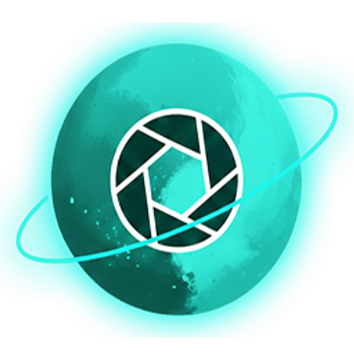

<p align="center">
  
</p>

<h1 align="center">Pluto Photos</h1>

<p align="center">
  <strong>Your photos. Your machine. Zero cloud. Total privacy.</strong><br/>
  A desktop photo & video organizer with on-device AI — no subscriptions, no cloud lock-in.
</p>

<p align="center">
  <a href="https://plutophotos.com">Website</a> ·
  <a href="https://plutophotos.com/#download">Download</a> ·
  <a href="https://plutophotos.com/blog">Blog</a> ·
  <a href="https://plutophotos.com/features">Features</a>
</p>

---

## What is Pluto Photos?

Pluto Photos is a desktop photo and video management app that runs **entirely on your machine**. All AI features — face detection, natural language search, background removal — process locally. Your photos never leave your computer.

**Buy once, own forever.** $29 one-time for Pro, or free for up to 500 photos.

## Features

| Feature | Tier |
|---|---|
| Tags, ratings & color labels | Free |
| Albums & slideshow | Free |
| Export photos | Free |
| Smart albums (rule-based, real-time updates) | Pro |
| AI face detection & grouping | Pro |
| AI contextual search (natural language, fully offline) | Pro |
| Map view with GPS clustering | Pro |
| Duplicate finder (perceptual hashing) | Pro |
| Photo editor (tone curves, HSL, presets, histogram) | Pro |
| Background removal (BiRefNet, no watermarks) | Pro |
| Batch operations (rename, tag, rate, export) | Pro |
| Cloud import (Google Photos Takeout, Immich) | Pro |
| Multi-track video editor (LUTs, green screen, watermarks) | Pro |
| Companion browser (access from phone/tablet on LAN) | Pro |
| Self-hosted Docker server | Pro |

## Platforms

- **Windows** — 64-bit `.exe` installer
- **macOS** — Universal `.dmg` (Apple Silicon & Intel)
- **Linux** — `.AppImage` and `.deb`
- **Docker** — Self-hosted server ([docker-compose.yml](https://plutophotos.com/docker/docker-compose.yml))
- **Arch Linux** — [AUR package](https://aur.archlinux.org/packages/pluto-photos-bin)

## Tech Stack

- **Framework:** Electron + Vue 3 + TypeScript (via [electron-vite](https://electron-vite.org))
- **Database:** better-sqlite3
- **Image processing:** Sharp (libvips)
- **AI / ML:** face-api.js (SSD MobileNet), ONNX Runtime, BiRefNet, BLIP captioning
- **Video:** FFmpeg
- **Build:** electron-builder (NSIS for Windows, DMG for macOS, AppImage/deb for Linux)

## Building from Source

> **Note:** This repo is [source-available](#license) — you can build and run locally for personal use.

### Prerequisites

- Node.js 20+
- npm 9+
- Python 3.x (for native module compilation)
- Platform-specific build tools (Visual Studio Build Tools on Windows, Xcode on macOS)

### Install

```bash
npm install
```

### Development

```bash
npm run dev
```

### Build

```bash
# Windows
npm run build:win

# macOS
npm run build:mac

# Linux
npm run build:linux
```

### AI Models

AI model weights are downloaded separately at build time:

```bash
node scripts/download-bg-model.mjs
node scripts/download-rmbg-model.mjs
node scripts/download-caption-model.mjs
```

## Try Pro Features

Built from source and want to test the full feature set? Pluto Photos includes a **free 30-day Pro trial** — no credit card required.

1. Open **Settings → License**
2. Click **Start Free Trial** and enter your email
3. All Pro features unlock instantly for 30 days

After the trial, the app reverts to the Free tier (up to 500 photos). To keep Pro, purchase a license at [plutophotos.com](https://plutophotos.com).

## Docker

Self-host Pluto Photos on your server or NAS:

```bash
curl -O https://plutophotos.com/docker/docker-compose.yml
curl -O https://plutophotos.com/docker/example.env
cp example.env .env
# Edit .env with your license key
docker compose up -d
```

See [DOCKER.md](DOCKER.md) for full setup instructions.

## Tests

```bash
npm run test
```

Runs the CI smoke test suite (~250 tests) covering the API server, database operations, import pipeline, and video editor.

## Contributing

Contributions are welcome! Please open an issue first to discuss what you'd like to change.

By submitting a pull request, you agree to the contribution terms in the [LICENSE](LICENSE).

## License

Pluto Photos is **source-available** — not open source. You may read, study, build, and contribute to the code, but you may not redistribute or commercialize it. See [LICENSE](LICENSE) for full terms.

## Third-Party Licenses

Pluto Photos uses open-source components including FFmpeg (GPL-3.0), Sharp/libvips (LGPL-3.0), and Electron (MIT). See [plutophotos.com/licenses](https://plutophotos.com/licenses/) for full attribution.

## Contact

- **Website:** [plutophotos.com](https://plutophotos.com)
- **Email:** [support@plutophotos.com](mailto:support@plutophotos.com)
